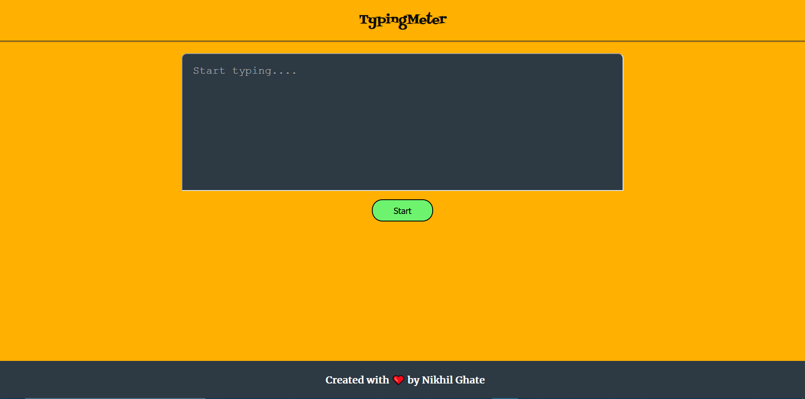
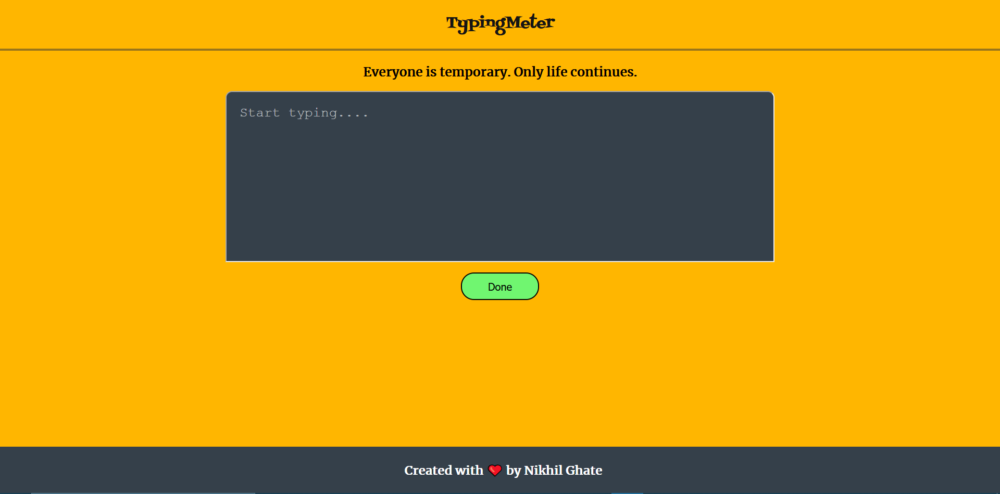
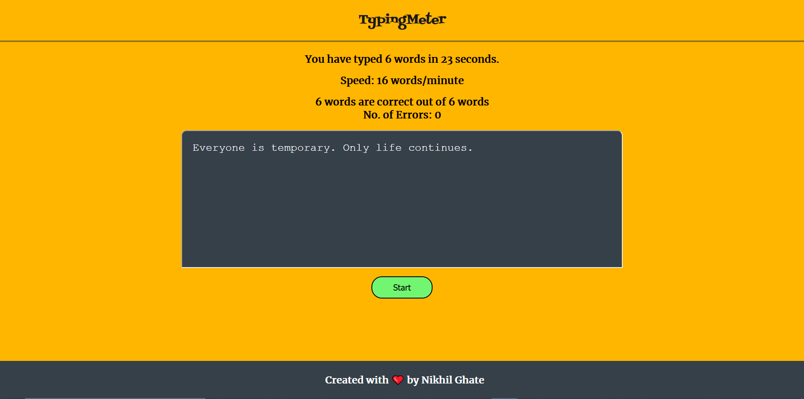
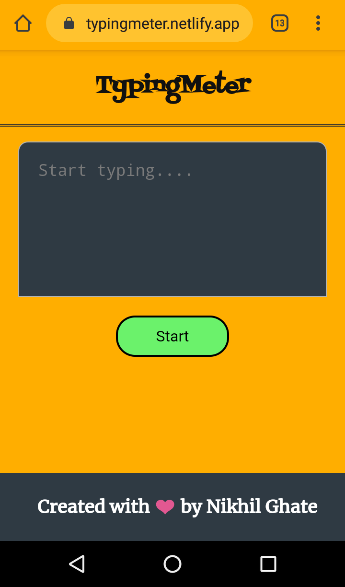

# TypingMeter
### Description: 
- TypingMeter is the system created to check the typing speed, no. of correct word typed and no. of errors. 
- Created using HTML, CSS and JavaScript only. Live at: https://typingmeter.netlify.app

### Features:
- Mobile Responsive
- Strongly case-sensitive
- Paste protected
- Applause sound effect on ideal condition (i.e. Speed >= 25 words per minute AND No. of errors <= 2)

 
### Desktop Snapshots:

### Mobile Snapshots:

